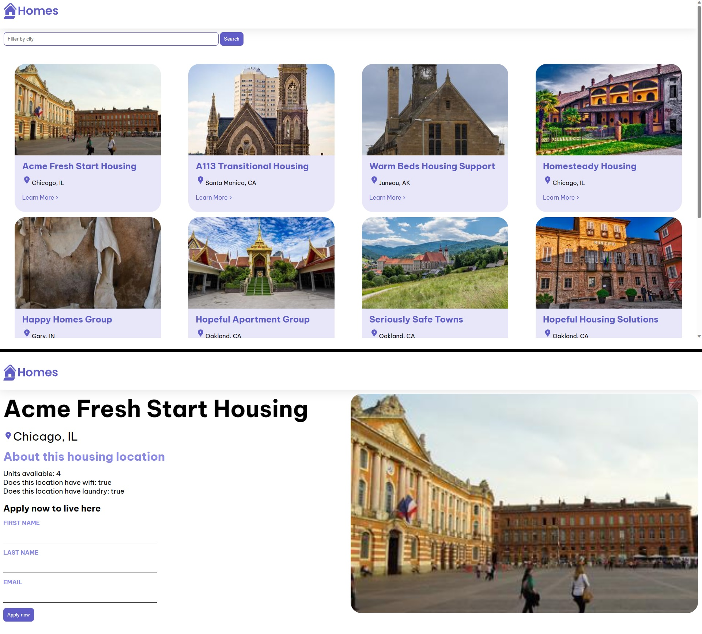

# Angular Tutorials - First-App

https://angular.io/tutorial/first-app

## App Interface

### :iphone: Planned Design

<p align="center"></p>

### :tada: Final Result

<p align="center"></p>

## Development server

Run `ng serve` for a dev server. Navigate to `http://localhost:4200/`. The application will automatically reload if you change any of the source files.

## Code scaffolding

Run `ng generate component component-name` to generate a new component. You can also use `ng generate directive|pipe|service|class|guard|interface|enum|module`.

## Build

Run `ng build` to build the project. The build artifacts will be stored in the `dist/` directory.

## Running unit tests

Run `ng test` to execute the unit tests via [Karma](https://karma-runner.github.io).

## Running end-to-end tests

Run `ng e2e` to execute the end-to-end tests via a platform of your choice. To use this command, you need to first add a package that implements end-to-end testing capabilities.

## Further help

To get more help on the Angular CLI use `ng help` or go check out the [Angular CLI Overview and Command Reference](https://angular.io/cli) page.

## Angular concepts

For essential angular concepts, see the README of previous tutorials at https://github.com/jobsonita/studies-angular-setupstartguides#readme

## New concepts learned in this tutorial

### Angular Interface

Angular can help us create TypeScript interfaces:

https://angular.io/tutorial/first-app/first-app-lesson-04#first-angular-app-lesson-4---creating-an-interface

```bash
ng generate interface <interface_name>
```

Example of generated interface:

```typescript
/* src/app/housing-location.ts */
export interface HousingLocation {
}
```

## JSON Server

During the last lesson of the tutorial, we use `json-server` to provide us with a mock REST API. If you don't have it, make sure to install it through npm:

```bash
npm install -g json-server
```

To make things easy, I added a `json-db` script to `package.json` that we can run through:

```bash
npm run json-db
```

The script will run the followin command:

```bash
json-server --host 0.0.0.0 --watch db.json
```

Once the JSON server is up, we can access localhost at port 3000 and fetch our data by accessing the `/db` (will return the whole database) or `/locations` (will return only the `locations` list) paths.

Note: on Codespaces, for the Angular app to be able to fetch data from the json-server, you need to set the fetch url to your Codespace url with port 3000, and set its visibility to public.
